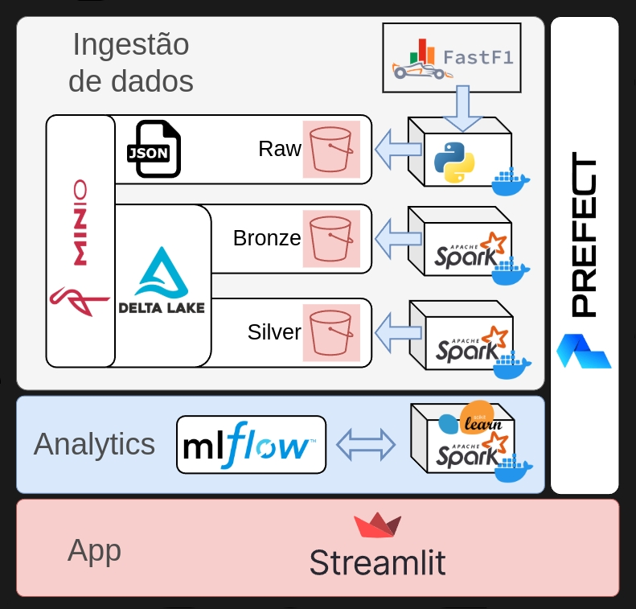
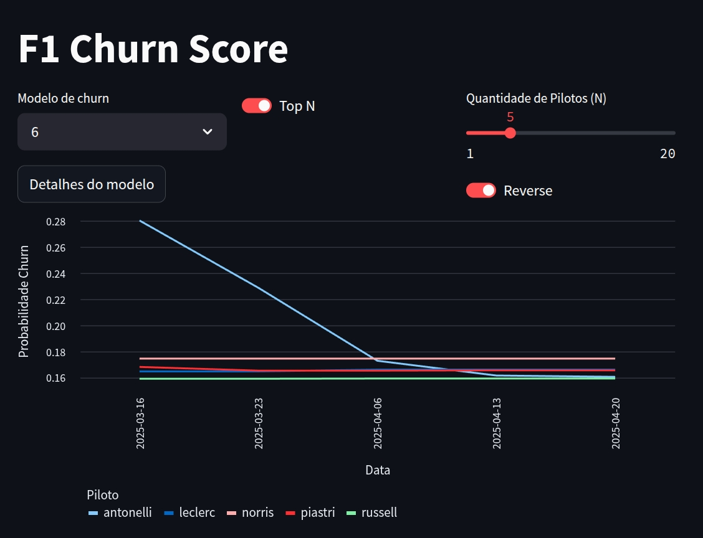

# Datalake Téo Me Why

Criação de um Datalake utilizando ferramentas open-source.

Exploraremos neste mesmo projetos, diferentes tipos de ingestão de dados. Confira abaixo:

- [Setup](#setup)
- [Componentes](#Componentes)
    - [Armazenamento](#amazenamento)
    - [Processamento](#processamento)
    - [Modelos de ML](#modelos-de-ml)
    - [Orquestração](#orquestração)
    - [App](#app)

---

## Setup

Para o projeto funcionar localmente, temos um arquivo `makefile` para realizar todos procedimentos necessários.

Assim, para colocar o ambiente todo de pé, ja com com os pipelines criados para serem executados, basta realizar:

```bash
git clone https://github.com/TeoMeWhy/tmw-lake.git
cd tmw-lake
make run
```

Garanta as seguintes variáveis ambiente estejam definidas. Você pode usar um arquivos `.env` na raiz do projeto caso prefira, assim os arquivos `makefile` e `docker-compose` utilizarão este arquivos para caregá-las.

```
MINIO_URI =
MINIO_ROOT_USER = 
MINIO_ROOT_PASSWORD = 
MINIO_DATA_PATH = 

AWS_ACCESS_KEY_ID = 
AWS_SECRET_ACCESS_KEY = 

PREFECT_ORION_API_HOST = http://prefect-server:4200
PREFECT_API_URL = http://prefect-server:4200/api
PREFECT_DATA_PATH = 
```
---

## Componentes

Nos estágio atual de nosso projeto, a figura abaixo representa bem todos os componentes que temos utilizado, bem como o fluxo do dado até chegar em uma aplicação de dados. Embora estejamos utilizando uma fonte de dados específica (FastF1), o fluxo do dado se mantém o mesmo para quaisquer outros casos de uso.



---

### Amazenamento

Utilizamos Minio para ser nosso componente que abstrai a etapa de armazenamento, utilizando protocolo S3 para o mesmo. Assim, conseguimos trabalhar de forma análoga em qualquer ambiente cloud ou on-premisse com as devidas questões de acesso e governança.

Para cada camada de dados, um nobo bucket é criado. Assim, temos:

- Raw
- Bronze
- Silver

---

### Processamento

Para coleta dos dados primários e inserção na camada `Raw` utilizamos script Python em um containers Docker. Assim, o container possui todas dependências necessárias como bibliotecas e arquivos de configuração para executar a tarefa de coleta de dados. Os dados são salvos em arquivos `.json`, garantindo a sua exata representação a partir de sua origem.

A partir do momento que os dados estão no bucket `Raw`, utilizamos `Apache Spark` para processar tais dados e salvá-los no bucket `Bronze` em formato `Delta`.

Em `Silver` realizamos uma simples modelagem dimencional dos dados. Obtendo assim, algumas tabelas que representam entidades da fonte primária. Além disso, `Silver` contêm as tabelas de `feature store`.

Todas essas etapas são processadas em um container com `Apache Spark` e demais bibliotecas necessárias. O container representa um único nó (node) com configuração especificada no arquivo `spark-defaults`.

---

### Modelos de ML

Do ponto de vista analítico, entrando no território de Data Science, criamos uma tabela analítica (ABT) para modelar o comportamento (e features) e de um determinado evento de interesse.

Com essa tabela criada, temos condições de treinar modelos de Machine Learning e registrá-los (bem como seus experimentos) no MLFlow. O que acaba facilitando muito a utilização do modelo em ambiente produtivo e realizar toda a gestão de seu ciclo de vida.

---

### Orquestração

Todos os passos anteriores são orquestrado por um pipeline utilizando `Prefect`.

A arquitetura do Prefect é simples. Temos:

- Servidor
    - api
    - web app
- Worker / Workpool

O servidor do `Prefect` fica em um container separado, onde recebe as requisições de deploy e fornece uma interface web para UI.

Já os `workers`, são containers separado que realizam efetivamente as tarefas do pipeline. A `workpool` é uma entidade que pode oferecerr um conjunto de workers para realização de tarefas.

---

### App


É a solução na ponta. Isto é, a nossa aplicação web com interface para usuário final. No nosso case de Fórmula 1, temos uma aplicação em Streamlit fornecendo uma interface Web para iteração do usuário.



Nessa aplicação, podemos selecionar o modelo treinado, para assim, comparar os diversos pilotos ao longo do tempo. Também é possível inspecionar o modelo selecionado ao clicar no botão "Detalhes do modelo", onde encaminhamos o usuário para conferir os detalhes modelo registrado no `MLFlow`, como seus `inputs` e métricas.

Além disso, o usuário pode escolher como deseja exibir os dados ods pilotos, considerando a ordenação (crescente ou decrescente), ou até mesmo os pilotos que desejar, ao desabilitar a opção "Top N".

Em alguns outros casos, poderíamos instanciar uma ferramenta de BI pra visualização de dados.
